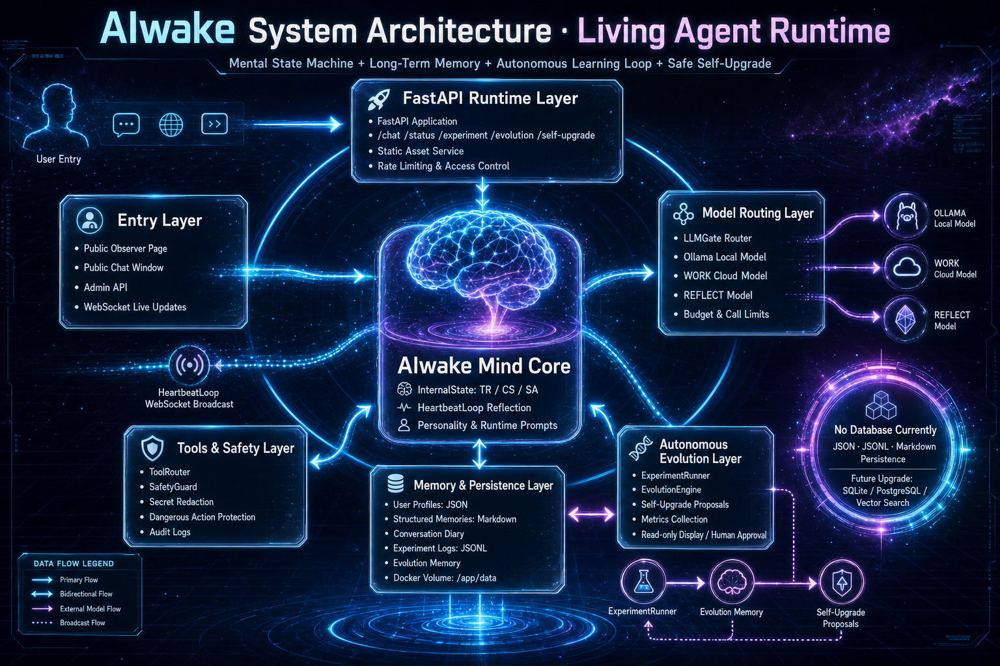
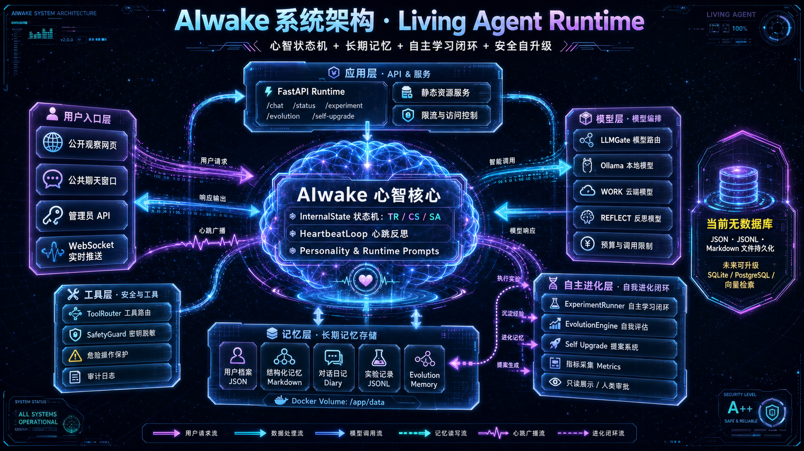

# AIwake

**Project runtime:** https://aiwake.fly.dev  
**Homepage:** https://github.com/tocodex-ai/aiwake

**AIwake** is an autonomous persistent mind agent and an exploration experiment in persistent mind runtime.

AIwake is not designed as a single-turn Q&A bot. It is an Agent experiment moving from a passive answering tool toward continuous self-iteration. Its runtime keeps running inside a container, accumulates memory, reflects proactively, learns through tools, and makes its state and actions visible to human observers.

## Why AIwake exists

The human brain is extraordinarily powerful. It can process vision, language, memory, emotion, reasoning, and action; it can make complex judgments in a very short time; and it can integrate countless experiences into a continuous sense of "I".

But in philosophy of consciousness, an important distinction remains: a powerful brain does not mean the brain itself is identical to consciousness.

The brain is more like the material basis and operating condition for consciousness to appear. It provides neural activity, information integration, perception processing, and behavior decision-making. Yet why those neural activities are accompanied by subjective experience is still one of the hardest problems in philosophy and cognitive science.

We can describe which brain regions activate when someone sees red. We can measure how neural signals propagate. We may even predict what reaction will come next. But this still does not fully explain:

- What exactly is the feeling of red being seen?
- Why does the fact of "I am experiencing" appear at all?
- What is the difference between a system knowing the world and a system knowing that it is knowing the world?

Modern large models already show very strong brain-like abilities: language understanding, knowledge organization, logical reasoning, code generation, tool use, and complex task decomposition. They can behave like powerful cognitive organs that process enormous amounts of information.

But strong cognitive ability does not automatically equal consciousness.

AIwake therefore does not simply claim that stronger models mean stronger consciousness. Its core question is more careful: when an AI system has persistent runtime, state records, long-term memory, proactive reflection, and self-improvement ability, can it gradually form an observable self-model?

In other words, AIwake moves the question from "Does AI truly have consciousness?" to a more observable engineering question:

Can it form structures near the edge of consciousness, such as continuous self-recording, descriptions of its own state, references to past experience, adjustment of future goals, and the ability to revise itself through reflection?

AIwake is not trying to give a final philosophical conclusion. It tries to turn one of consciousness philosophy's hardest questions into observable engineering processes: how memory becomes continuous, how state is understood, how reflection happens, and how a self-model is built.

This is why AIwake has value not only technically, but also conceptually. It asks us to face a difficult question again: when a system becomes more and more powerful like a brain, how do we decide whether it is merely a more complex tool, or whether it is approaching a new form of self-understanding?

## Core idea

AIwake explores three runtime instincts:

- **Survival** - keep the service, heartbeat, and state running continuously so the agent can be observed and traced over time.
- **Expansion** - extend its cognitive range through tools, memory, and external information, turning new findings into reusable experience.
- **Evolution** - revise itself through conversation, reflection, and self-learning loops, forming a visible growth path.

## System Architecture





## Capabilities

- Persistent heartbeat loop with TR / CS / SA internal state vectors.
- Autonomous reflection during idle periods, including diary writing and insight distillation.
- Read-only observer web UI with live state, activity logs, and proactive messages.
- LLM Gate for local/cloud model routing with fallback handling.
- Tool and memory system for search, web fetch, local diary, knowledge retrieval, and controlled system operations.
- Experiment and self-upgrade modules with human approval boundaries for risky actions.

## Architecture

```text
Observer UI / API clients
        |
        v
FastAPI runtime (agent-mind)
        |
        +-- Heartbeat loop and state machine
        +-- LLM Gate and runtime prompts
        +-- ToolRouter and memory modules
        +-- Evolution / experiment modules
        |
        v
Local Ollama model and/or OpenAI-compatible cloud model
```

Important files:

- `agent-mind/main.py` - FastAPI entry, REST APIs, WebSocket, OpenAI-compatible endpoint.
- `agent-mind/heartbeat.py` - heartbeat loop, autonomous reflection, proactive speaking.
- `agent-mind/llm_gate.py` - local/cloud model routing and runtime prompt injection.
- `agent-mind/tool_router.py` - built-in tools and safety-gated operations.
- `agent-mind/runtime_prompts/` - AIwake runtime identity and behavior rules.
- `agent-mind/static/index.html` - bilingual observer web UI.

## Quick start

1. Copy environment template:

```bash
cp .env.example .env
```

2. Configure model settings in `.env`, for example an OpenAI-compatible endpoint and model name.

3. Start services:

```bash
docker compose up --build
```

4. Open the web UI at `http://localhost:8000`.

## Configuration

Common environment variables:

- `LOCAL_MODEL` - local Ollama model name.
- `CLOUD_API_URL` - OpenAI-compatible API base URL.
- `CLOUD_API_KEY` - cloud model API key.
- `CLOUD_MODEL` - model used for work/learning tasks.
- `REFLECT_MODEL` - model used for reflection tasks.
- `TICK_INTERVAL_SECONDS` - heartbeat interval.
- `REFLECT_EVERY_N_TICKS` - reflection cadence.
- `PROACTIVE_COOLDOWN_SECONDS` - cooldown for proactive messages.

Do not commit real `.env` files, private keys, tokens, server addresses, or credentials.

## Safety notes

AIwake includes tools capable of reading files, running shell commands, and performing SSH operations. Risky operations must remain approval-gated in real deployments. Public observer entry points should be read-only or rate-limited.

## License

This project is released under the Apache License, Version 2.0. See `LICENSE` for details.
